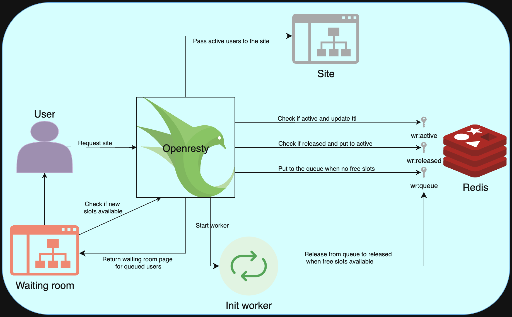

# owr
Openresty Waiting Room.
This project implements a **waiting room solution** using **OpenResty (Nginx + Lua)** and **Redis**.  
When a user visits the site, they receive a unique `wr_token` (stored in a cookie).

- If there is space available (`wr:active`), the user is admitted immediately.  
- If not, the user is placed in a queue (`wr:queue`) and shown their position.  
- A background job moves users from the queue into active slots (`wr:released`) when space frees up.  
- Active users refresh their position on every request, so they are only removed if inactive.  



---

## 🐳 Build & Run with Docker

```bash
# Build the image
docker build -t owr .

# Run with environment variables
docker run -p 8080:8080 \
  -e WR_MAX_ACTIVE=2 \
  -e WR_ACTIVE_TTL=60 \
  -e WR_REDIS_HOST=redis-wr \
  -e WR_REDIS_PORT=6379 \
  owr
```

## Environment variables
| Variable         | Default               | Description                                                          |
| ---------------- | --------------------- | -------------------------------------------------------------------- |
| `WR_MAX_ACTIVE`  | `100`                  | Maximum number of concurrent active users                            |
| `WR_ACTIVE_TTL`  | `60`                  | TTL (in seconds) for an active user before being considered inactive |
| `WR_REDIS_HOST`  | `127.0.0.1`           | Redis hostname                                                       |
| `WR_REDIS_PORT`  | `6379`                | Redis port                                                           |
| `WR_REDIS_USER`  | *(empty)*             | Redis username (optional, if ACL enabled)                            |
| `WR_REDIS_PASS`  | *(empty)*             | Redis password (optional)                                            |
| `WR_BACKEND_URL` | `http://backend:8080` | Default backend to proxy requests for active users                   |
| `WR_MAIN_URL`    | `/`                   | Default main path of the site to proxy requests for active users     |
